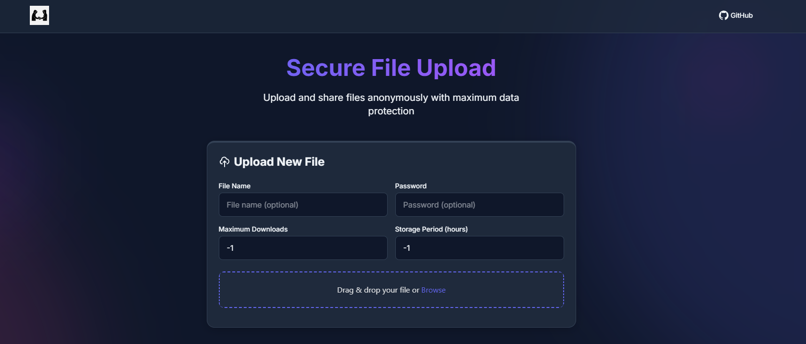
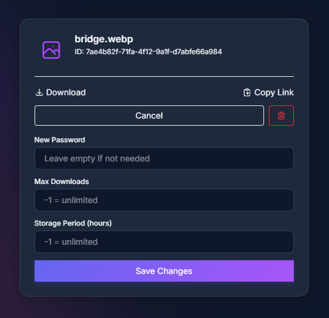
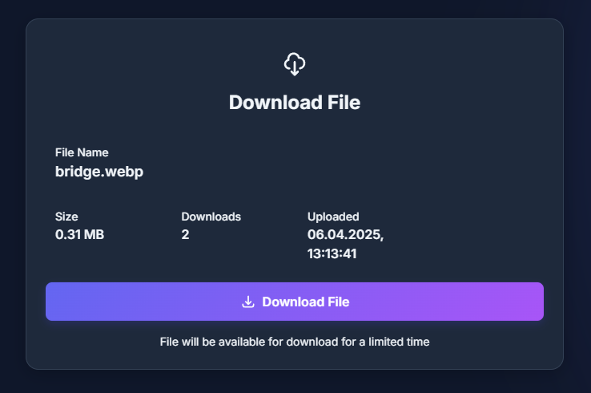

# FileSharing

[DEMO](https://share.ll-u.pro)

FileSharing is an application for anonymous file uploading built with [Next.js](https://nextjs.org). It allows users to upload files and share download links.

## 🚀 Features

-   Anonymous file uploading
-   Unique download link generation
-   Support for various file types
-   Modern interface using Tailwind CSS

## 📦 Installation

1. Clone the repository:

    ```bash
    git clone https://github.com/your-repo/anon-file-upload.git
    cd anon-file-upload/frontend
    ```

2. Install dependencies:

    ```bash
    bun install
    ```

3. Configure environment variables:

    Create a `.env` file in the `frontend` folder and add:

    ```env
    API_URL=http://localhost:3000
    ```

4. Start the development server:

    ```bash
    bun run dev
    ```

5. Open [http://localhost:3001](http://localhost:3001) in your browser.

## 🖼️ Screenshots





## 📜 License

This project is licensed under the MIT License. See [LICENSE](LICENSE.md) for more details.
